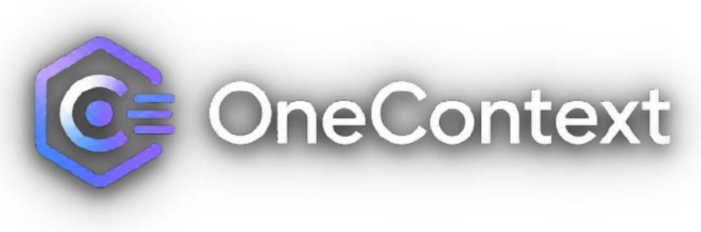
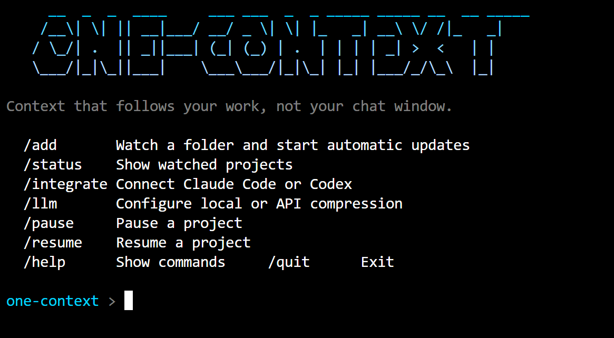

> [!WARNING]
> ## Experimental Alpha
>
> one-context is an experimental local context compiler. It is a research and
> learning project, not a production-ready context-management system.
>
> The current `v0.1.0-alpha.1` release explores automatic repository watching,
> deterministic project handoffs, optional LLM compression, and Claude/Codex
> integrations. These ideas are still being validated in real development
> workflows.

> Do not rely on one-context for critical workflows, sensitive repositories, or
> irreplaceable engineering history without testing it independently first.
>
> Development of the current compiler direction may pause or change while a more
> focused architecture-evolution skill is evaluated. There is no compatibility
> guarantee with the legacy MCP/Python implementation or future experiments.
>
> Issues, feedback, and real-world failure reports are welcome.
>

<p align="center">
  
</p>

> 
one-context is a local background service that keeps project context compact and current.
It is being shaped around a simple workflow:
> 

- auto-discover or register repos once
- watch them in the background
- compress meaningful changes into a small context artifact
- let Claude, Codex, or another assistant read that artifact directly

<p align="center">
  
</p>

## Product direction

- one command starts an onboarding flow, registers folders, starts the local
  background service, and writes assistant-ready artifacts automatically
- the service compiles repository state from Git and file changes; it does not
  try to read a model's private conversation context
- the default handoff is deterministic and always available
- Ollama or an API can optionally improve the language of a handoff, but an LLM
  never becomes the source of truth

The current Go implementation is an early foundation. The intended v1 interface
and delivery sequence are defined in `IMPLEMENTATION_PLAN.md`.
Release evidence required before an alpha tag is listed in `docs/RELEASE_GATE.md`.
Alpha installation and testing instructions are in `docs/INSTALLATION.md`.

## Build

```powershell
go build -o one-context.exe ./cmd/one-context
```

## Current developer commands

```powershell
.\one-context.exe --help
.\one-context.exe version
.\one-context.exe add F:\combinedcontext
.\one-context.exe status

# Machine-readable health for scripts.
.\one-context.exe status --json
```

`add` compiles the first handoff, starts the daemon when needed, and watches the
repository automatically. File events are debounced; a 15-minute reconciliation
scan catches events the operating system may have missed.

Check the generated artifacts without changing them:

```powershell
.\one-context.exe validate
```

Enable automatic launch at login once, after installing the binary in a stable
location:

```powershell
.\one-context.exe startup install
```

In an interactive terminal, running `one-context` with no arguments opens the
slash-command palette. Use `/add` and paste the folder to watch.

## Assistant access

After registering a project, install each bridge once:

```powershell
# Creates <project>/.claude/commands/one-context.md.
.\one-context.exe install claude F:\ASRT

# Creates the user-level Codex one-context skill.
.\one-context.exe install codex

# One command installs both bridges for this registered project.
.\one-context.exe install all F:\ASRT
```

Then, from `F:\ASRT`:

- In Claude Code, enter `/one-context`.
- In Codex, invoke `$one-context` in a new session if the skill was just installed.

Both bridges only read `F:\ASRT\.one-context\context.md`. They do not overwrite
`CLAUDE.md`, `AGENTS.md`, or existing user instructions.

## Compression today

Default mode is deterministic and does not need an LLM.
It uses:

- Git branch and recent commits
- dirty working tree and bounded diff excerpts
- active task and explicit handoff
- standard repo anchor files such as `README.md`, `AGENTS.md`, and `CLAUDE.md`

When enabled, `context.md` remains the factual source of truth and
`llm-context.md` becomes the separate model-written handoff. Configure it once:

```powershell
# Local/private Ollama compression.
.\one-context.exe /llm ollama qwen3:4b

# OpenAI-compatible API compression. The key is never stored by one-context.
$env:ONE_CONTEXT_API_KEY = "..."
.\one-context.exe /llm api <model> [base-url]

# Anthropic Claude API.
$env:ANTHROPIC_API_KEY = "..."
.\one-context.exe /llm claude <model>

# Google Gemini API.
$env:GEMINI_API_KEY = "..."
.\one-context.exe /llm gemini <model>

# Limit provider attempts per UTC day. Use 0 for unlimited (the default).
.\one-context.exe /llm limit 25

# Keep global LLM settings but disable provider calls for one sensitive project.
.\one-context.exe config F:\ASRT --llm off
```

The provider and model are saved locally; API keys stay only in environment
variables. Changing a provider refreshes enabled projects immediately. The
daemon remains responsible for later automatic updates.

Remote providers receive a bounded handoff prompt containing selected Git and
project evidence. one-context excludes common credential-file paths and
redacts common token formats before the request, but this is defense in depth,
not a guarantee that no sensitive data is sent. Use Ollama when source must
remain on the machine.
